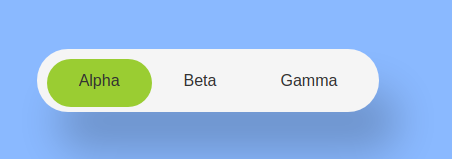

# slidey-nav

Source can be found on https://github.com/duleorlovic/slidey-nav

This project requires jQuery.
Screenshot



Preview
[https://duleorlovic.github.io/slidey-nav/](https://duleorlovic.github.io/slidey-nav/)

To start developing using webpack-dev-server with automatic reload

```
yarn start
```

This will open a browser at [http://localhost:8082/](http://localhost:8082/)

# How to start local web development using webpack dev server

```
mkdir my_app
cd my_app
yarn init -y
yarn add -D webpack webpack-cli webpack-dev-server html-webpack-plugin node-sass sass-loader style-loader css-loader file-loader
yarn add jquery
mkdir src
```

```
# webpack.config.js
const path = require('path')
const HtmlWebpackPlugin = require('html-webpack-plugin')

module.exports = {
  entry: path.resolve(__dirname, 'src', 'index.js'),
  output: {
     path: path.resolve(__dirname, 'dist'),
     filename: 'bundle.js'
  },
  devServer: {
    contentBase: './dist'
  },
  plugins: [
    new HtmlWebpackPlugin({
      template: 'src/index.html'
    })
  ],
  module: {
    rules: [
      {
        test: /\.(png|svg|jpg|gif|woff|woff2|eot|ttf|otf)$/,
        use: [
          'file-loader'
        ]
      },
      {
        test: /\.(scss|sass|css)$/i,
        use: [
          // Creates `style` nodes from JS strings
          'style-loader',
          // Translates CSS into CommonJS
          'css-loader',
          // Compiles Sass to CSS
          'sass-loader',
        ]
      }
    ]
  },
  mode: 'none'
}
```

And create `src/index.html` and `src/index.js`

```
# src/index.html
<html>
  <head>
  </head>
  <body>
    Hello <span id='world' class='red'></span>
  </body>
</html>
````

```
# src/index.js
import $ from 'jquery'

// add styles
import './style.sass'

$('#world').text('World!')
```

```
# src/index.sass
.red
  color: red
```
